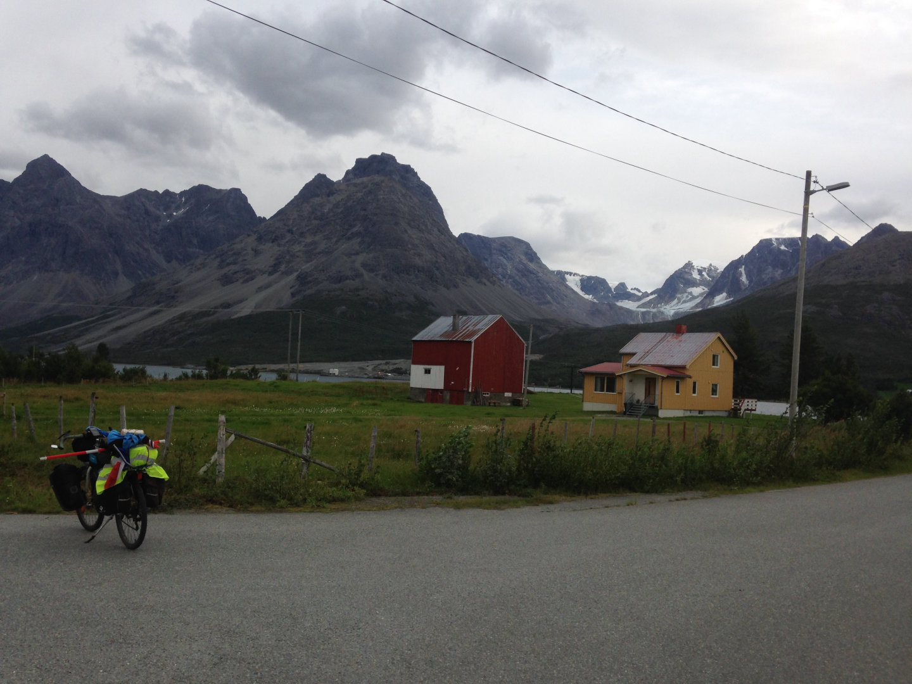

Après un petit déjeuner sous le soleil du Troms, je sors tant bien que mal de la ville en passant chez un marchand de cycles pour huiler ma chaîne. La route que j'empreinte longe en grande partie l'E8 qui est très passante, mais je suis contraint de rouler sur cette dernière sur quelques tronçons. S'en vient ensuite une longue route dans une vallée creusée par un glacier, monotone mais très belle et bien roulante.

J'arrive tout juste pour le départ du bac pour Svensby dans lequel je m'offre l'immense plaisir d'un café au lait. Entre temps le vent à tourné et je me retrouve à lutter 20km contre celui ci, loupant le bac pour Olderdalen. J'ai donc 45 minutes d'attente que j'occupe à écrire ces lignes.